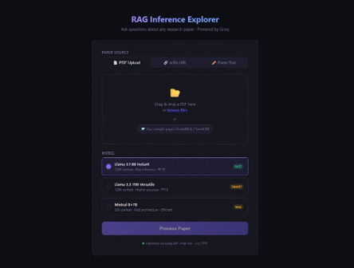
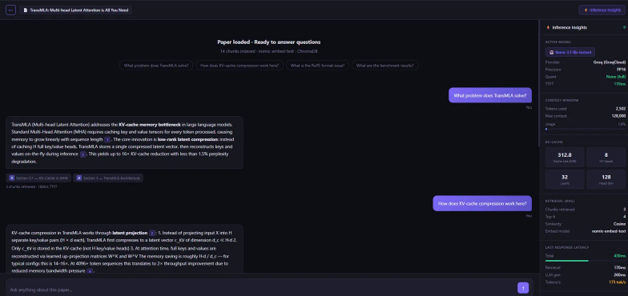

# RAG Inference Explorer

**Ask questions about research papers — and watch what the LLM is actually doing under the hood.**

Upload a paper (PDF, arXiv URL, or raw text) → ask questions → get cited answers, alongside a live **Inference Insights** panel showing KV-cache growth, latency breakdown, and context-window utilization.



---

## What makes this different from a generic RAG chatbot

There are plenty of "chat with your PDF" demos built on the same stack. This one adds an **inference-observability layer** — after every query, real metrics computed from each model's actual architecture:

| Metric | What it shows |
|---|---|
| **TTFT** | Time to first token — where Groq's speed advantage shows up |
| **KV-cache size** | `2 × L × H × D × T × 2 bytes / 1024²` — computed from real token counts and the model's true layer/head/dim config |
| **Context used** | % of the model's context window consumed by retrieval + query |
| **Tokens/sec** | Generation throughput, from Groq's server-side timing |
| **Latency split** | Retrieval time vs. LLM generation time, separated — not one opaque number |

The KV-cache formula is the same one used in the [TransMLA paper](https://arxiv.org/abs/2502.07864) to motivate multi-head latent attention. **This app exists to make that math interactive** — it grew out of my hands-on work on LLM inference optimization (KV-cache analysis and MLA conversion on SmolLM and Qwen models).



---

## Example session

Run against the TransMLA paper (*Multi-head Latent Attention is All You Need*):

**Q: What problem does TransMLA solve?**
> TransMLA addresses the KV-cache memory bottleneck in LLMs. Standard Multi-Head Attention caches key/value tensors for every token, so memory grows linearly with sequence length. The core innovation is low-rank latent compression: instead of caching full key/value heads, TransMLA stores a single compressed latent vector and reconstructs keys/values on-the-fly during inference — up to 16× KV-cache reduction with under 1.5% perplexity degradation. *(cites §2.1, §3)*

**Q: What is the RoPE format issue?**
> A subtle but critical implementation detail: naive implementations apply RoPE to the compressed latent vector *before* caching, which is incorrect — RoPE's rotation matrix is parameterized over the full head dimension, but the latent has a smaller dimension. The fix is to apply RoPE *after* the up-projection that reconstructs keys from the latent. *(cites §3.2)*

**Q: What are the benchmark results?**
> On SmolLM-135M and Qwen3-4B: 14.8×–16.2× KV-cache reduction, +1.1–1.2% perplexity, and 1.9×–2.1× throughput gains — most pronounced at long sequences (4096+ tokens) where memory bandwidth, not compute, is the bottleneck. *(cites §4)*

---

## Architecture

```
app.py                  # Gradio UI + event wiring
rag/
  processor.py          # PDF → text → chunks → ChromaDB
  retriever.py          # query → top-k chunks (cosine similarity)
  llm.py                # Groq API call + inference metrics
tests/
  test_rag.py           # unit tests for the pipeline
```

## Tech stack

| Component | Technology |
|---|---|
| UI | Gradio |
| LLM | Groq API — `llama-3.1-8b-instant` / `llama-3.3-70b-versatile` / `mixtral-8x7b` |
| Embeddings | `BAAI/bge-small-en-v1.5` via sentence-transformers |
| Vector DB | ChromaDB, in-memory (per session, no persistence) |
| Retrieval | Top-k cosine similarity |
| PDF parsing | PyMuPDF |
| Chunking | LangChain `RecursiveCharacterTextSplitter` (512 chars, 64 overlap) |

---

## Local setup

```bash
git clone https://github.com/Nidhi1202/rag-inference-explorer.git
cd rag-inference-explorer

python -m venv venv
venv\Scripts\activate          # macOS/Linux: source venv/bin/activate

pip install -r requirements.txt
cp .env.example .env           # add your GROQ_API_KEY

python app.py                  # opens at http://localhost:7860
```

Get a free Groq API key at [console.groq.com](https://console.groq.com).

---

## How the KV-cache metric works

```
cache_bytes = 2 × L × H × D × T × 2
```

**L** = layers · **H** = KV heads · **D** = head dimension · **T** = total tokens. The leading `2` accounts for both keys and values; the trailing `2` is bytes per FP16 element. Each model's `L`, `H`, `D` come from its published architecture, so the figure reflects that specific model rather than a generic estimate.

---

## Notes

Inference runs on Groq's servers via API; the app itself is lightweight (CPU embeddings + web UI). Metrics are computed from published model configs and Groq's server-side timing — intended to build intuition, not to replace hardware profiling.

## License

MIT
